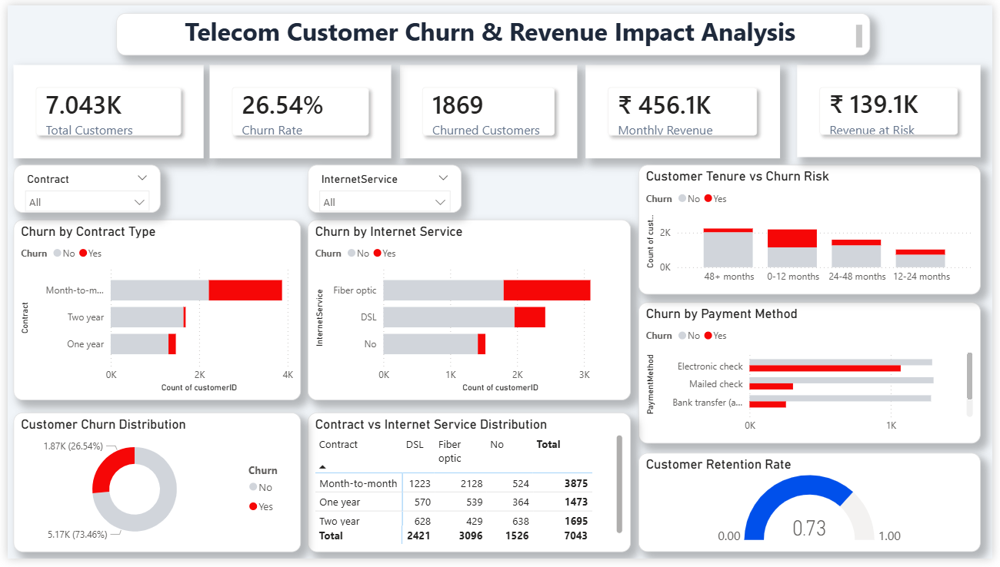

# Telecom Customer Churn & Revenue Impact Analysis

Author: Ayush Dhakite  
GitHub: https://github.com/ayushgit08-cmyk

## Project Overview
This project analyzes telecom customer churn using SQL and Power BI to identify key churn drivers and understand revenue impact caused by customer attrition.

## Developed By
Ayush Dhakite

## Tools Used

* SQL (MySQL)
* Power BI
* Excel

## Dataset

Telco Customer Churn Dataset containing 7043 telecom customers with attributes such as tenure, contract type, payment method, monthly charges, and churn status.

## Key KPIs

* Total Customers
* Churn Rate
* Customers Churned
* Monthly Revenue
* Revenue Lost due to Churn

## Key Insights

* Month-to-month contract customers show significantly higher churn rates.
* Customers using electronic check payment methods churn more frequently.
* Customers with tenure under 12 months show the highest churn risk.
* Fiber optic customers contribute high revenue but also show elevated churn.

## Dashboard Preview



## Project Structure

```
telecom-customer-churn-analysis
│
├── churn_dashboard.pbix
├── telco_churn_dataset.csv
├── SQL_queries.sql
├── dashboard_preview.png
└── README.md
```

## Business Impact

Understanding churn behavior helps telecom companies design better retention strategies, reduce customer loss, and improve revenue stability.
